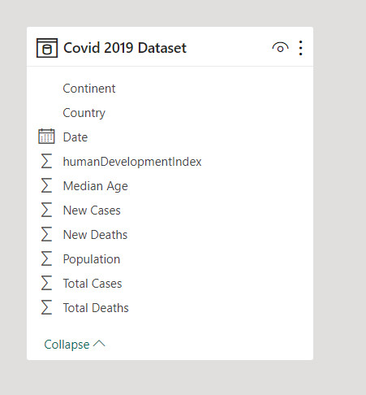

#  COVID 2019 Analaysis (Top 10 Asian Countries)

## Abstract
### We analyzed the COVID 2019 dataset by using the Power BI tool, so we extracted the top 10 Asian countries for the highest cases and death rates, as well as the median age and total deaths by country.

## Dataset

|Field|Description
|-:|-:|
|Continent|Name Continent|
|Country|Name Country|
|Date|Case Date|
|Total Cases|The Cases number for each country in Continent|
|New Cases |The new cases number for each country in Continent|
|Total Deaths|The death number for each country in Continent|
|New Deaths|The new death number for each country in Continent|
|Population|The Population number for each country in Continent|
|Median Age|Median Age for case in each country
|humanDevelopmentIndex| parcentage number for human development

## Data Model [PowerBI Desktop]

## Report Creation [PowerBI Desktop]
.gif)

## Visualization Tools
- image
- Blank
- Pie Chart
- Area Chart
- Line Chart
- Scatter Chart

