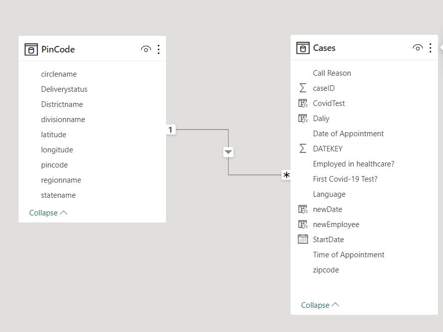

#  Health Care Analysis project

### Abstract: 
### We analyzed the Health Care dataset by using the Power BI tool, so we extracted useful information such as Day Wise Schedule Appointment, Call Reason, Location Wise Cases Counts, Covid Test, and others.

## Dataset

|Table|Fields|
|-:|-:|
|Cases|caseID, StartDate, DATEKEY, Employed in healthcare?, Call Reason, First Covid-19 Test?, Language, Date of Appointment, Time of Appointment, zipcode, newDate, Daliy, newEmployee, CovidTest|
|PinCode|pincode, Deliverystatus, divisionname, regionname, circlename, Districtname, statename, longitude, latitude|

## Data Model [PowerBI Desktop]

## Report Creation [PowerBI Desktop]

## Report on Novypro: [Click here](https://www.novypro.com/project/health-care-analysis-project)

## Visualization Tools
- image
- Text box
- Clustered Column Chart
- Clustered bar Chart
- Pie Chart
- Donut Chart
- Slicer
- Matrix
- Map

