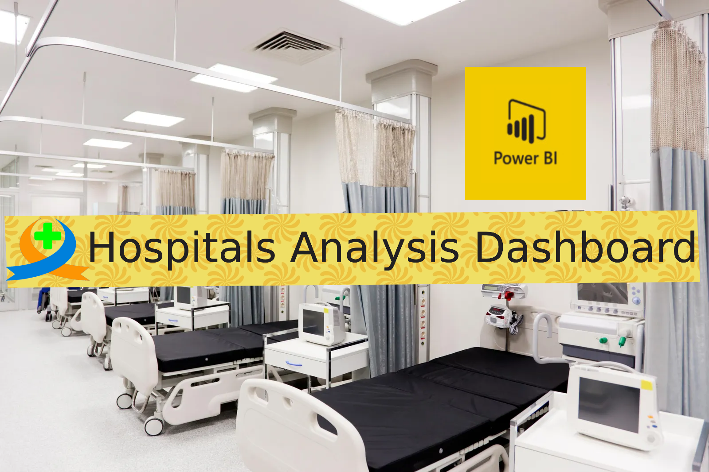

#  Hospitals Analysis project

## Abstract
### We used confirmed, recovered, and death datasets for all hospitals in all countries. By using the PowerBI tool, we explored useful statistical information to  know the highest rate of confirmed, recovered, and dead countries in hospitals.

## Dataset
There are four files:

|Country Details.xlsx|Recovered.xlsx|Confirmed.xlsx|Deaths.xlsx
|-:|-:|-:|-:|
|Area (US, Adams, IN)|Province/State(Washington)|Province/State (Adams, IN)|Province/State (Solano, CA)
|Country/Region (US)|Country/Region (US)|Country/Region (US)|Country/Region (US)
|Province/State (Adams, IN)|Lat (47.4009)|Lat (39.8522)|Lat (38.3105)
|Lat (39.8522)|Long (-121.491)|Long (-77.2865)|Long (-121.9018)
|Long (-77.2865)|Date (1/22/2019 0:00)|Date (1/22/2019 0:00)|Date (1/22/2019 0:00)
| |Recovered (0,1)|Confirmed (0,1)|Death (0,1)|
| |Status (Recovered)|Status (Confirmed)|Status (Death)
| |Area (US, Washington)|Area (US, Washington)|Area (US, Solano, CA)

## Data Model [PowerBI Desktop]
A data model where dimensions and facts are separated is then linked together by logical relationships to form a star schema. The resultant data model is shown below...

## Report Creation [PowerBI Desktop]

## Visualization Tools
- Card
- image
- Text Box
- Pie Chart
- Clustered Pie Chart
- Table
- Map
- Area Chart
- Rotating Tile by MAQ Software
- Button with Action (BookMark)
- Scroller

