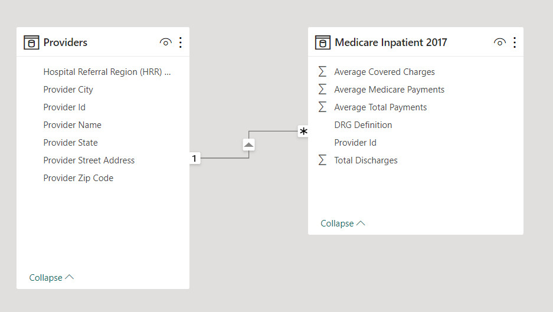

#  Health Care Analysis project

### Abstract: 
### We analyzed the Medicare Inpatient 2017 dataset by using the Power BI tool, so we extracted useful information such as Average Total Payments and Average Medicare Payments by Provider Name, Average Total Payments by Provider State, and others.

## Dataset

|Table|Fields|
|-:|-:|
|Medicare Inpatient 2017|DRG Definition, Provider Id, Total Discharges, Average Covered Charges, Average Total Payments, Average Medicare Payments|
|Providers|Provider Id, Provider Name, Provider Street Address, Provider City, Provider State, Provider Zip Code, Hospital Referral Region (HRR) Description|

## Data Model [PowerBI Desktop]

## Report Creation [PowerBI Desktop]

## Visualization Tools
- image
- Text box
- Card
- Clustered bar Chart
- Gauge
- Slicer
- Map

