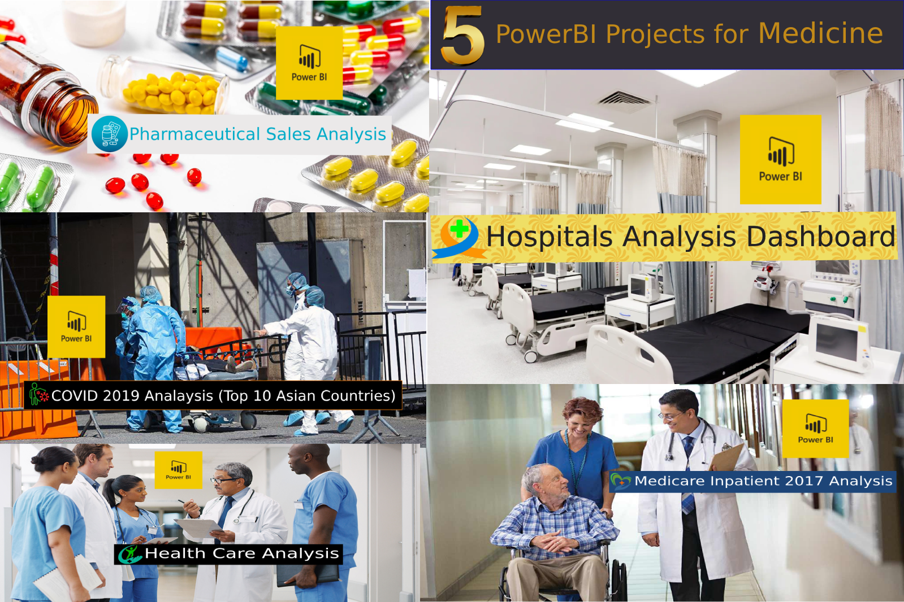

# Five PowerBI Projects for Medicine

## 1. Hospitals Analysis project
### Abstract: 
### We used confirmed, recovered, and death datasets for all hospitals in all countries. By using the PowerBI tool, we explored useful statistical information to know the highest rate of confirmed, recovered, and dead countries in hospitals.
[click here to see more details](./Hospitals%20Analysis%20Dashboard/)

## 2. Pharmaceutical Sales Analysis project
### Abstract: 
### We analyzed a global pharmaceutical manufacturing company's raw sales data and gained meaningful insights. By using the PowerBI tool, we built a data model where dimensions and facts are separated by the provided data is in a single table format, and then they are linked together by logical relationships to form a star schema. So we extracted useful information by analyzing pharmaceutical sales, distributor and customer information, and sales team performance.
[click here to see more details](./pharmaceutical-sales-analysis/)

## 3. COVID 2019 Analaysis (Top 10 Asian Countries) project
### Abstract: 
### We analyzed the COVID 2019 dataset by using the Power BI tool, so we extracted the top 10 Asian countries for the highest cases and death rates, as well as the median age and total deaths by country.
[click here to see more details](./COVID%202019%20Analysis%20(Top%2010%20Asian%20Countries)/)

## 4. Health Care Analysis project
### Abstract: 
### We analyzed the Health Care dataset by using the Power BI tool, so we extracted useful information such as Day Wise Schedule Appointment, Call Reason, Location Wise Cases Counts, Covid Test, and others.
[click here to see more details](./Health%20Care%20Analysis%20Dashboard/)

## 5. Medicare Inpatient 2017 Charges project
### Abstract: 
### We analyzed the Medicare Inpatient 2017 dataset by using the Power BI tool, so we extracted useful information such as Average Total Payments and Average Medicare Payments by Provider Name, Average Total Payments by Provider State, and others.
[click here to see more details](./Medicare%20Inpatient%202017/)