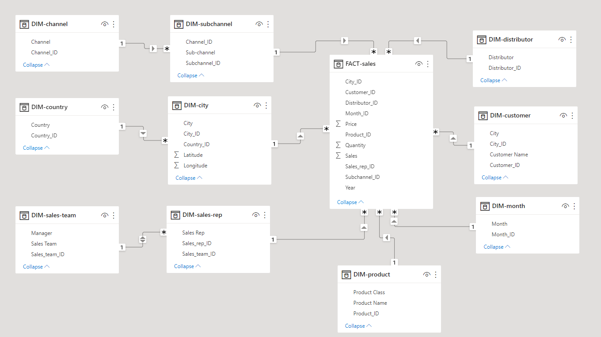

#  Pharmaceutical Sales Analysis project

## Abstract
### We analyzed a global pharmaceutical manufacturing company's raw sales data and gained meaningful insights. By using the PowerBI tool, we built a data model where dimensions and facts are separated by the provided data is in a single table format, and then they are linked together by logical relationships to form a star schema. So we extracted useful information by analyzing pharmaceutical sales, distributor and customer information, and sales team performance.

## Dataset
The dataset is sourced from each distributor. It contains Pharmaceutical Manufacturing Company’s, Wholesale-Retail Data. The field description of the raw data is given below. The raw dataset pharma-data.csv can be downloaded from [here](https://drive.google.com/file/d/1npKF_C2tG5psY-at4wvpEgh6T-7KHxEZ/view?usp=share_link)

|Field|Description|
|-:|-:|
|Distributor|Name of Wholesaler|
|Customer Name|Name of customer|
|City|Customer's city|
|Country|Customer's country|
|Latitude|Customer's Geo Latitude|
|Longitude|Customer's Geo Longitude|
|Channel|Class of buyer (Hospital, Pharmacy)|
|Sub-channel|Sector of the buyer (Government, Private, etc.)|
|Product Name|Name of Drug|
|Product Class|Class of Drug (Antibiotics, etc.)|
|Quantity|Quantity purchased|
|Price|Price product was sold for|
|Sales|Amount made from sale|
|Month|Month sale was made|
|Year|Year sale was made|
|Name of Sales Rep|Name of the Sales rep who facilitated the sale|
|Manager|Sales rep's Manager Name|
|Sales Team|Sale rep's team|

## Data Model [PowerBI Desktop]
The provided data is in a single table format. The exploration revealed that it contains both categorical (dimensions) and numeric (facts) data.

We build a data model where dimensions and facts are separated, then they are linked together by logical relationship to form a star schema. The resultant data model is shown below...

## Report Creation [PowerBI Desktop]

## Visualization Tools
- Card
- Multi-row card
- Multi Info Cards
- image
- Text Box
- Slicer
- Line Chart
- Clustered Column Chart
- Donut Chart
- Stacked bar chart
- Matrix
- Map
- Button with Action (Page Navigation)

